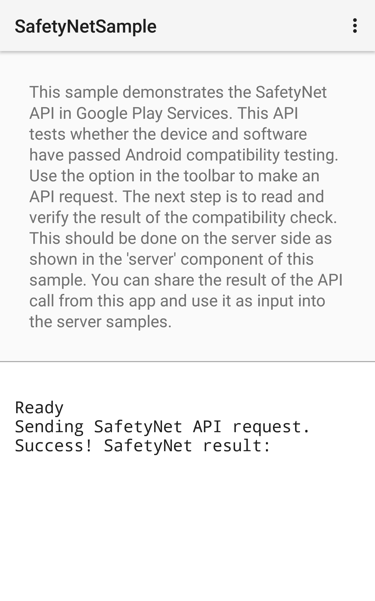

Java Android SafetyNet Sample
===================================

This sample demonstrates the SafetyNet API in Google Play Services. This API tests
whether the device and software have passed Android compatibility testing.
Use the option in the toolbar to make an API request.
The next step is to read and verify the result of the compatibility check. This should be done on
the server side as shown in the 'server' component of this sample.
You can share the result of the API call from this app and use it as input into samples for the
[server component](../../../server).

For more details, see the guide at https://developer.android.com/training/safetynet/index.html.

Pre-requisites
--------------

- Android SDK 25
- Latest Android Build Tools
- Latest Google Play Services
- Android Support Repository

Screenshot
-------------

Getting Started
---------------

This sample uses the Gradle build system. To build this project, use the
"gradlew build" command or use "Import Project" in Android Studio and select the directory
`SafetyNetSample`.

You need to set up an API key for the SafetyNet attestation API and reference it in this project.
Follow the steps in the [SafetyNet Attestation API][add-api-key] guide to set up an API key in the
Google Developers console. Then, override the configuration in the `gradle.properties` file to set
the key. This value is used for the call to
<a href="https://developers.google.com/android/reference/com/google/android/gms/safetynet/SafetyNetClient.html#attest(byte[], java.lang.String)">`SafetyNetClient# attest()`</a>.

Support
-------

If you've found an error in this sample, please file an issue:
https://github.com/googlesamples/android-play-safetynet

Patches are encouraged, and may be submitted by forking this project and
submitting a pull request through GitHub. Please see CONTRIBUTING.md for more details.

License
-------

Copyright 2016 Google Inc.

Licensed to the Apache Software Foundation (ASF) under one or more contributor
license agreements.  See the NOTICE file distributed with this work for
additional information regarding copyright ownership.  The ASF licenses this
file to you under the Apache License, Version 2.0 (the "License"); you may not
use this file except in compliance with the License.  You may obtain a copy of
the License at

http://www.apache.org/licenses/LICENSE-2.0

Unless required by applicable law or agreed to in writing, software
distributed under the License is distributed on an "AS IS" BASIS, WITHOUT
WARRANTIES OR CONDITIONS OF ANY KIND, either express or implied.  See the
License for the specific language governing permissions and limitations under
the License.

[add-api-key]: https://developer.android.com/training/safetynet/attestation.html#add-api-key
